# Lab-08: Explore Microsoft Cloud App Security

## Lab scenario
In this lab, you will explore the capabilities of Microsoft Cloud App Security.  You will walk through the information available on the Cloud Discovery dashboard as well as capabilities available to investigate findings and control impact to your organization through policies.  Note:  An organization must have a license to use Microsoft Cloud App Security which is a user-based subscription service. 

## Task 1: Explore Cloud Discovery

1.	Open Microsoft Edge. In the address bar enter **https://portal.cloudappsecurity.com**, sign in with your admin credentials.
   

1. Sign in with your admin credentials. In the Sign in window,

1. Enter Email/Username: <inject key="AzureAdUserEmail"></inject> , then select **Next**.
      
1. Enter the admin * Password: <inject key="AzureAdUserPassword"></inject> and  select **Sign in**.
   
1. On the left menu Under **Discover** select **Create snapshot report**. 
  
>- **Note**: if could not found under **Discover** then select **Settings** in the top right corner and click **settings**, Under **Cloud Discovery** select **Snapshot           Reports**, and click **+Create Snapsnot Report**.
   
    
   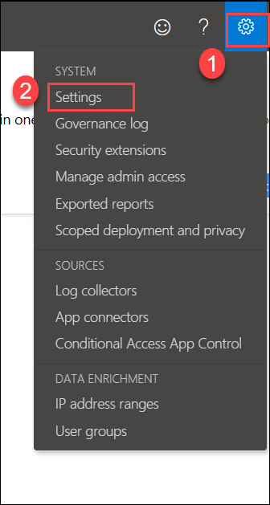
   
   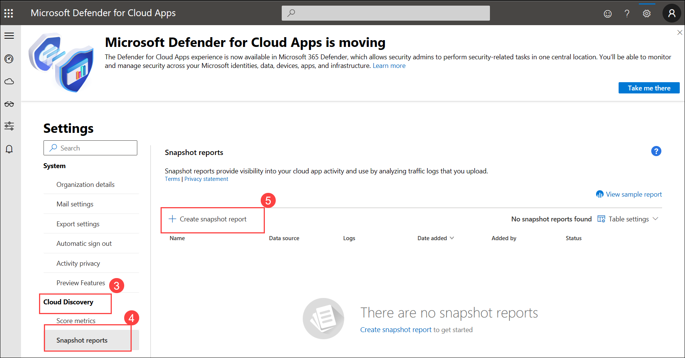
    

6. Collect log files from your firewall and proxy, through which users in your organization access the Internet. Make sure to gather logs during times of peak traffic that are representative of all user activity in your organization.

7. If you don't have a log file follow the below steps to download a sample log file.
 
8. Under overview tab, click **Next**.
    
9. Under **Report Details** tab, Enter a **Report name** and a **Description**. Select the **source** from which you want to upload the log files. Click **View log formate** then Download sample log and click on **Next**.
 
   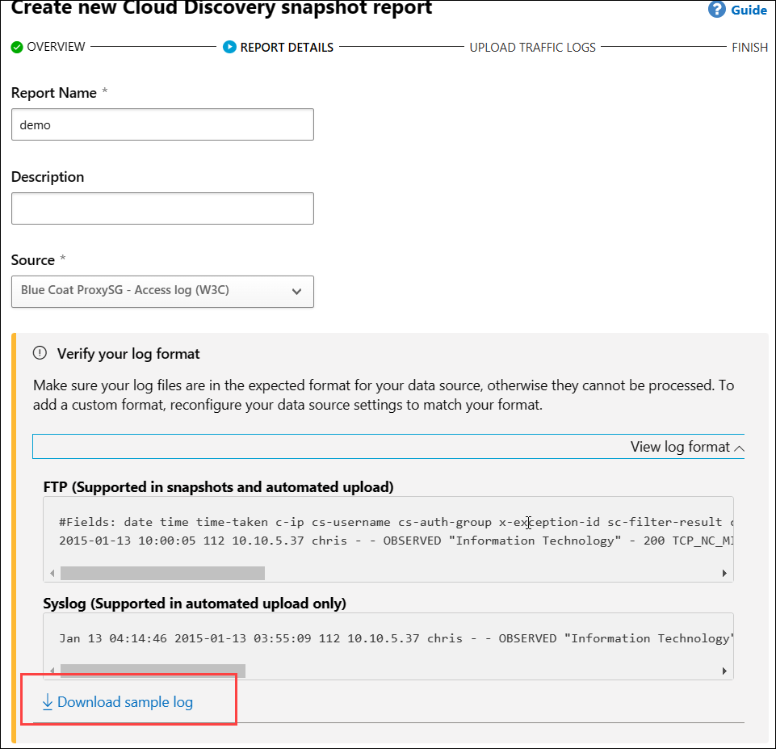
 
10. Under **Upload Traffic Logs** Tab, In **Choose traffic logs** browse and upload the log file which you downloaded. Click **Upload logs**.

11. After the upload completes, click on **snapshot reports** link on Create new Cloud Discovery snapshot report page.
12. After you upload your log files, it will take some minutes for them to be parsed and analyzed. Wait till the status of your log files turns **Ready**.

    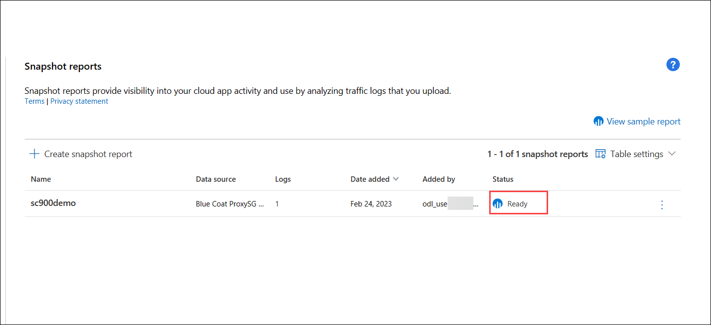
    
13. In the New tab  enter **admin.microsoft.com**

14. Sign in with your admin credentials.
    1. In the Sign in window enter Email/Username: <inject key="AzureAdUserEmail"></inject>  then select **Next**.
    1. Enter the admin password  Password: <inject key="AzureAdUserPassword"></inject>
    1. When prompted to stay signed-in, select **Yes**. This takes you to the Microsoft 365 admin center page.

15. From the left navigation pane of the Microsoft 365 admin center, select **Show all**.

16. Under Admin centers, select **Security**.  A new browser page opens to the welcome page of the Microsoft 365 Defender portal.  

    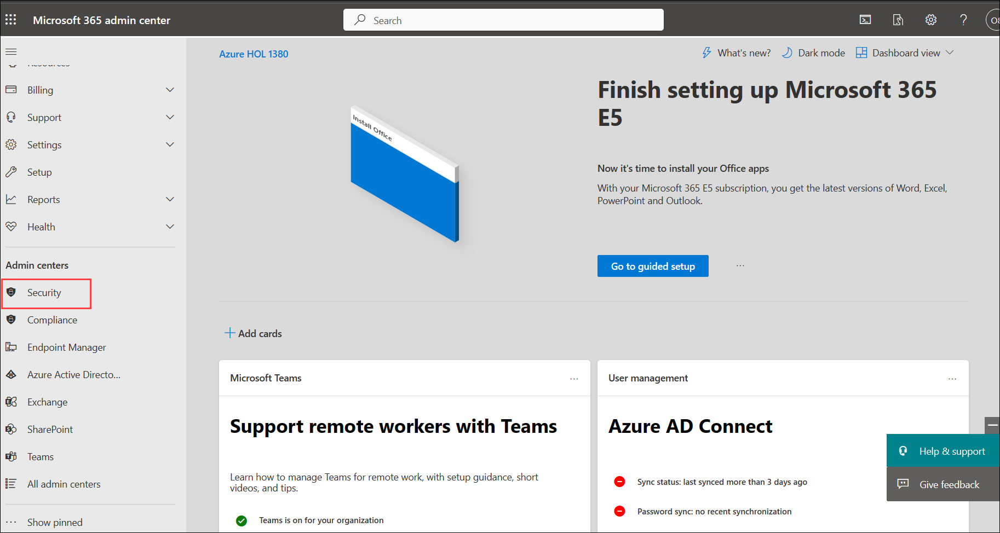
    
17. If this is the first time you visit the Microsoft 365 Defender portal, you may get a pop-up window to take a quick tour.  Close this.

18. From the left navigation panel, select **Cloud apps** to expand the list then select **Cloud Discovery**. This takes you to the Dashboard view.  Note the information available on the dashboard. From the dashboard view, you can select different tabs from the top of the page.  

    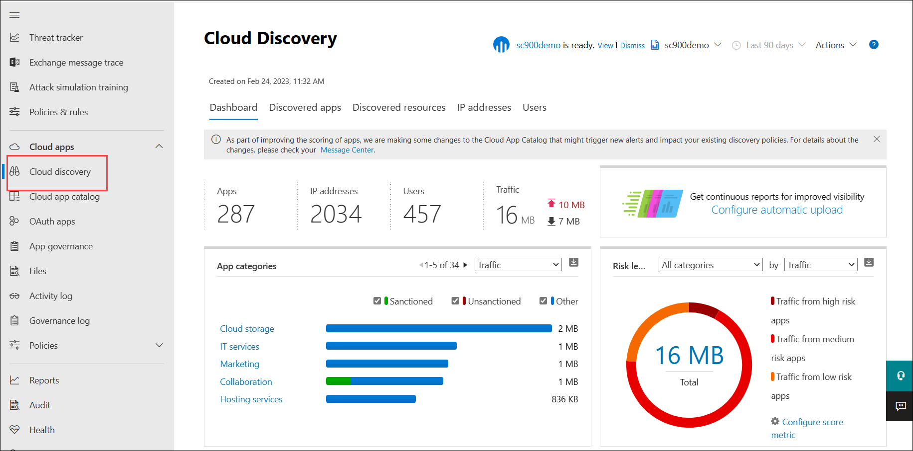

19. In the Cloud Discovery page, select the **Discovered apps** tab.  The discovered apps window provides a more detailed view of the discovered apps, including risk score, traffic, number of users and more.

    

 20. From any item on the list, select the **ellipses** in the actions’ column of the table.  Note the various options available, including the ability to tag an app as sanctioned or unsanctioned.  Select the ellipses, again, to close the actions box.
 
     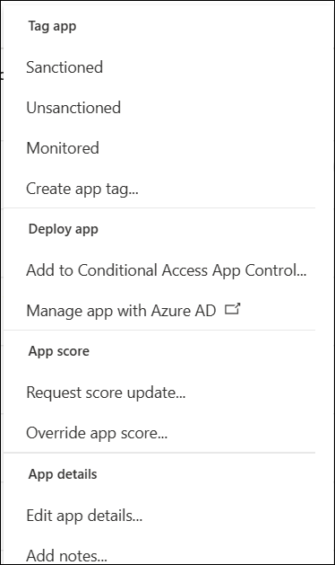

21. Selecting a specific line item opens a details page for the specific app. Select an item from the list and review the information available on the overview page.  For the selected item,

22. select the **Cloud app usage** tab to see more detailed information, including  **Usage**, **Users, IP**, **Addresses**, and **Alerts**.

23. When you're done exploring the details page, return to discovered apps page, by selecting **Cloud Discovery** from the bread crumb on the top of the page.

24. If you select Cloud discovery from the left navigation panel, it will take you back to the dashboard view.
 
25. From the top of the page, select the **IP addresses** tab (this is equivalent to selecting IP addresses from the left navigation pane).

>- Here you will find data including number of transactions, amount of traffic and upload amounts, by IP addresses.  Note that you can also filter by specific IP address or    export the data for further analysis.

   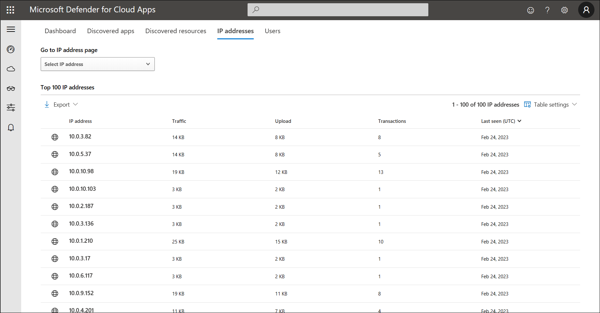
  
26. From the top of the page (or the left navigation pane) select **Users**.

>- This is the same type of information provided when you select IP addresses, but instead it is listed for individual users.  Here again, you filter by specific user and      export data for further analysis.
   
27. Click on view all discovered app to view the detailed information.

       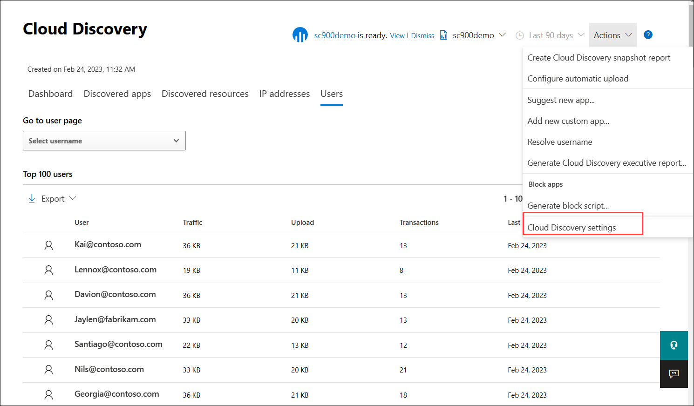
    

28. The information provided in these tabs is based on either snap-shot reports from traffic logs you manually upload from your firewalls and proxies or from continuous reports that analyze all logs that are forwarded from your network using Cloud App Security.
   

29. You can connect to apps directly by setting up app connectors that will provide you with greater visibility and control over your cloud apps. From the top right corner of the screen, select **Actions** then select **Cloud Discovery Settings**.  From the left side of the screen, under Connected apps, select **App connectors**.
    
30. Now you'll set up a new app connector.  Select **+Connect an app** and from the drop-down list select **Microsoft 365**.

31. From the Microsoft Azure pop-up window, select **Connect Microsoft 365** then select **Done**.

32. You'll see a connected status (if you don't see it, refresh the browser) and information on scanning users, data, and activities.  Return to the Cloud Discovery dashboard, by selecting **Cloud Discovery** from the left-most navigation panel.
    
    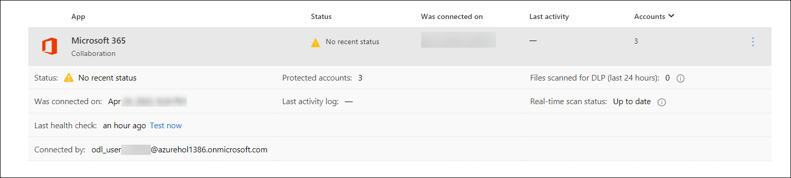
    
33. Now you'll set up a another new app connector.  Select **+Connect an app** and from the drop-down list select **Microsoft Azure**.

34. From the Microsoft Azure pop-up window, select **Connect Microsoft Azure** then select **Done**.  You'll see a connected status (if you don't see it, refresh the browser) and information on scanning users, data, and activities.
  
35. Return to the Cloud Discovery dashboard, by selecting **Cloud Discovery** from the left-most navigation panel.
    
    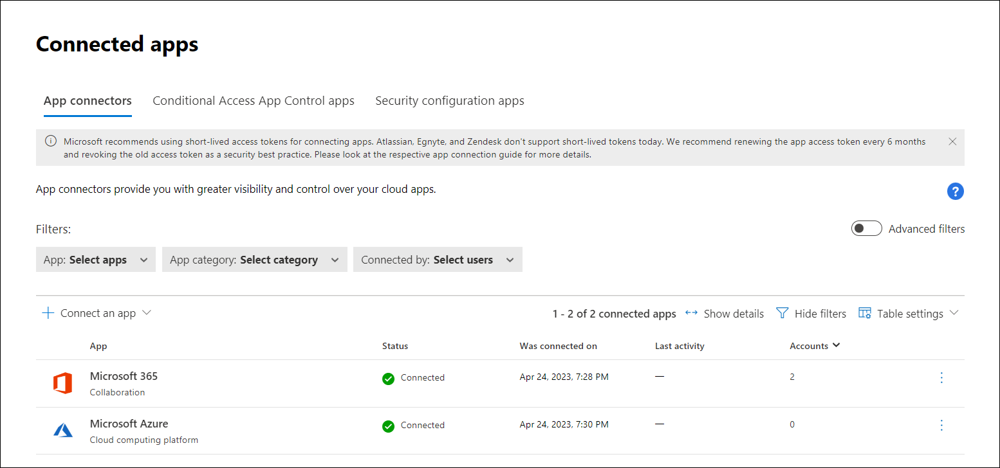

## Task 2: Explore the Cloud app catalog

Cloud Discovery analyzes your traffic logs against the Microsoft Defender for Cloud Apps cloud app catalog of over 31,000 cloud apps. The apps are ranked and scored based on more than 80 risk factors to provide you with ongoing visibility into cloud use, Shadow IT, and the risk Shadow IT poses to your organization.  In this task, you'll explore the capabilities of the Cloud app catalog.

1. From the left navigation panel, select **Cloud app catalog**.

    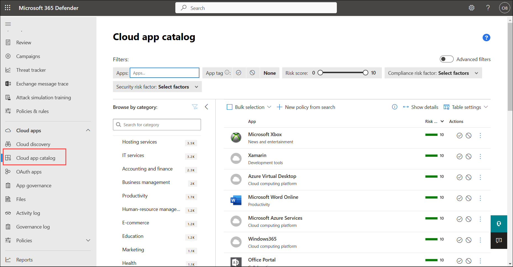

>- The Cloud app catalog enables you to choose apps that fit your organization's security requirements. Admins can do basic filtering of apps as shown on the top of the page, which includes whether the app is sanctioned, unsanctioned, or has no tag, risk score, Compliance risk factor, and security risk factor.  For example, filtering by compliance risk factor lets you search for a specific standards, certification, and compliance that the app may comply with. Examples include HIPAA, ISO 27001, SOC 2, and PCI-DSS.

2. Select **Compliance risk factor** to view the available options.  You can further filter by risk score, by moving the sliders on the risk score on the top of the page. If you moved the slide, be sure to set it so the range is set at 0 to 10.

3. Admins can also search for apps by category.  For example, in the search for category field enter **Yammer**, then select **Social network**.  Select **Yammer** for a detailed view.  Hovering your mouse over any topics for a given category will show an information icon that you can select to get more information about that topic.

    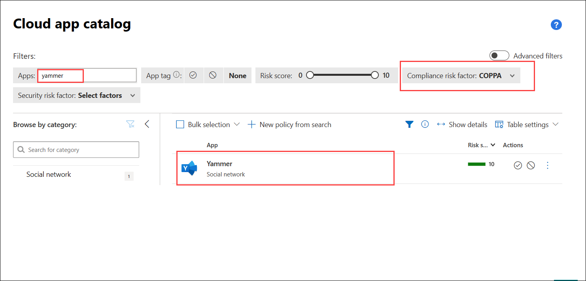

## Task 3: Explore the Activity log and Files

1. From the left navigation pane, select and explore the **Files** option and note the options to filter data by app, owner, access level, file type, and matched policy. Also, note the option to create a new policy from search and export of the data.

2. Select **+ New policy from search**.

>- Note how you can create a policy based on a template, select a policy severity & category, create filters for the policy, create alerts, and even send the alerts to Power Automate.

3. Select **Cancel** to exit of the policy creation window, then select **Leave page**.

   >**Note**: If you don't find above option click on **Enable file monitoring** link and select the **Enable file monitoring** checkbox click on save and perform the above               task.

    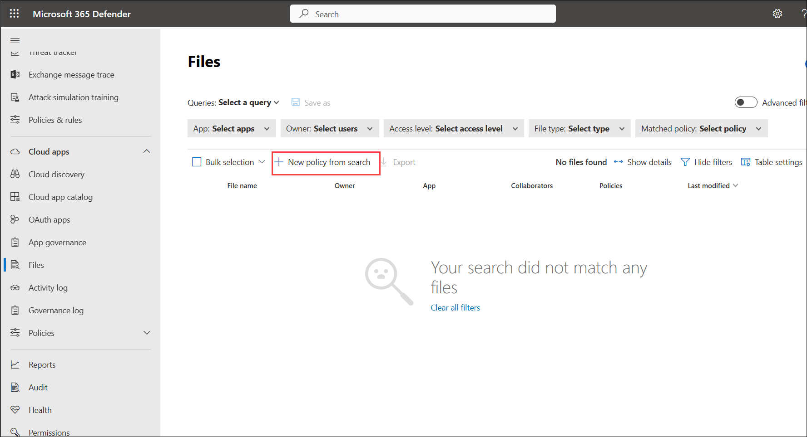

4. From the left navigation panel, select **Activity Log**. Here you get visibility into all the activities from your connected apps.

5. You may not see any data listed as it can take several hours to perform retroactive scans once audit is enabled and lab tenants may experience longer than normal delays. Note the available filter options and the option to create new a policy from search.

## Task 4: In this task you will explore the policies and alerts pages in Microsoft Cloud app security

1. From the left navigation panel, select **Policies** then select **Policy management**.  The listed policies provide information on the number of alerts generated by the     policy, severity, etc.

2. Selecting any line item provides more detailed information about the policy. Select an item from the list, i.e., **Risky sign-in**. 

    >- Note that you can also create a policy. Select **+ Create policy** to view the types of policies you can create.  Select **Activity policy** to view the different 
       options available for creating the policy.  Select **Cancel** to exit out of the configuration window.
 
     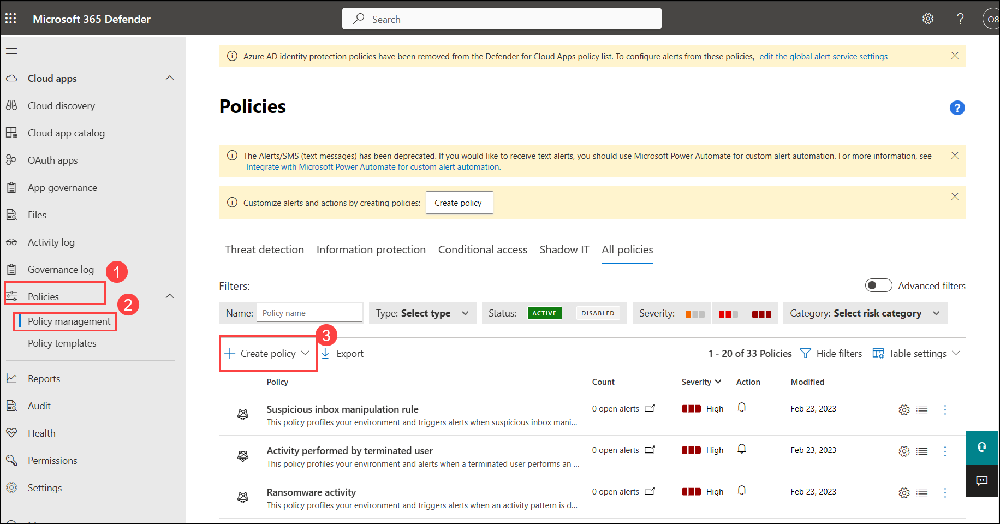
     
     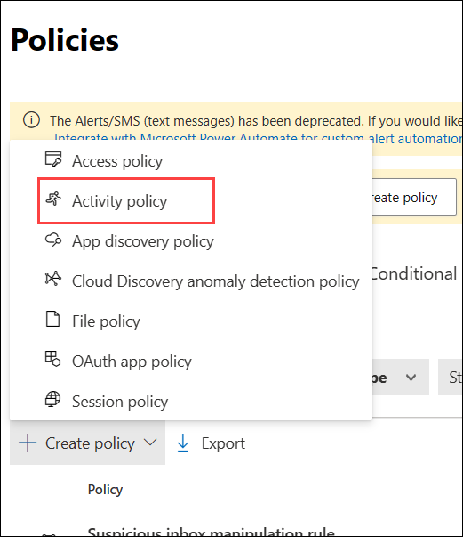
     
    >**Note**: that you can also have the option to export policy information.

3. From the left navigation panel, select **Policy templates**. To create a policy from one the available templates, select the **+** on the left side of the template line item.  View the different configuration options for the policy.  Select **Cancel** to exit out of the page.

   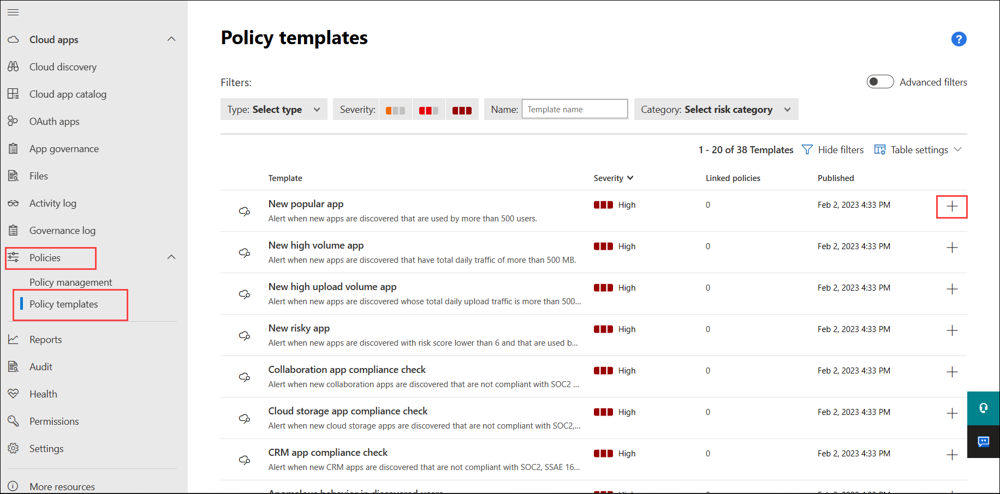

4. Close the browser window.

> **Congratulations** on completing the task! Now, it's time to validate it. Here are the steps:

- Navigate to the Lab Validation Page, from the upper right corner in the lab guide section.
- Hit the Validate button for the corresponding task. If you receive a success message, you can proceed to the next task. 
- If not, carefully read the error message and retry the step, following the instructions in the lab guide.
- If you need any assistance, please contact us at labs-support@spektrasystems.com. We are available 24/7 to help you out.

### Review
In this lab, you explored the capabilities of Microsoft Cloud App Security.  You walked through the information available on the Cloud Discovery dashboard as well as capabilities available to investigate findings and control the impact to your organization through policies.
