# Lab-16: Explore Azure Policy

## Lab scenario
Azure Policy helps to enforce organizational standards and to assess compliance at-scale. Azure Policy evaluates resources in Azure by comparing the properties of those resources to business rules. In this lab, you will start by exploring the Azure policy landing page. After the initial exploration of the Azure policy page, you will create a policy and see the impact of that policy.

## Task 1: Briefly explore the Azure policy page.

1. If you are not already signed into the Azure portal, sign in to the Azure portal at https://portal.azure.com with the Azure credentials.

1. On **Sign in to Microsoft Azure** blade, you will see a login screen, in that enter the following email/username and then click on **Next**. 
   * Email/Username: <inject key="AzureAdUserEmail"></inject>

1. Now enter the following password and click on **Sign in**.
   * Password: <inject key="AzureAdUserPassword"></inject>

1.  You're now in the Azure portal.  In the search box, in the blue bar on the top of the page next to where it says Microsoft Azure, enter **policy**, then select **Policy** from the search results. This opens the Policy home page that provides a dashboard view.  The scope for the Dashboard view is the Azure subscription provided by the authorized lab hoster (ALH). You'll see a policy listed, this is a policy created by the ALH, for use of the Azure subscription.

    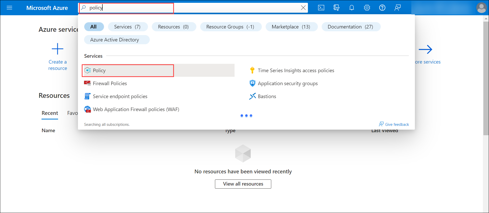
    
1. Form the left navigation panel, under Authoring, select **Assignments**.

    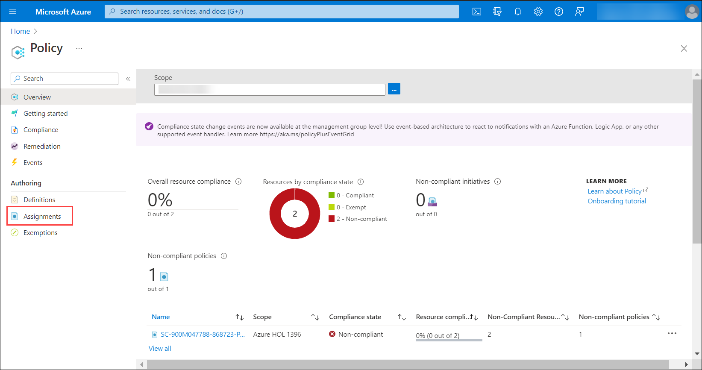
    
1. From the top of the page, select **Assign policy**. The Assign policy wizard opens to guide the admin in the process of assigning a policy.

    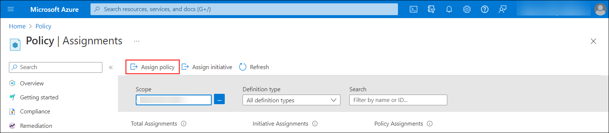
  
1. You start in the Basics tab.
    1. For the Scope, leave the default setting. In this case, the scope of the policy is the Azure subscription provided by the authorized lab hoster (ALH).
    
    1. For the Policy Definition, select the **ellipses**.  A list of the available policy definitions is provided.  In the search bar enter, **Require a tag**. From the search results, select **Require a tag on resource groups** (you may need to scroll down), then press **Add**.  Note: the effect of this policy is to Deny the creation of any new resource group that does not satisfy the requirement. 

     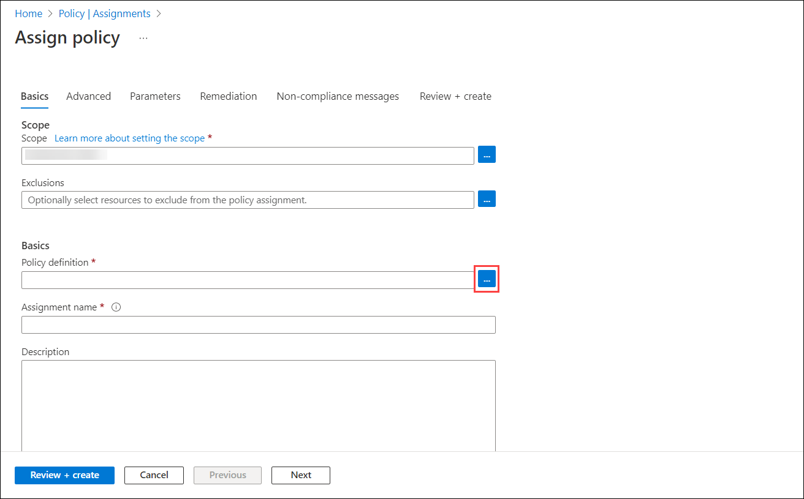
     
     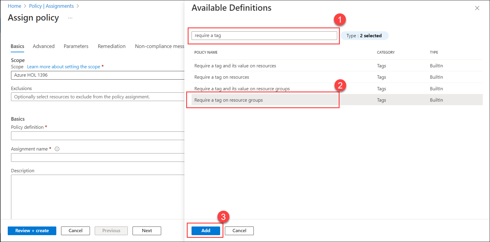

    4. Note the default assignment name.  Keep the name as is.
    5. Ensure that Policy enforcement is set to **Enabled**
    6.  Select **Next**. 
   
     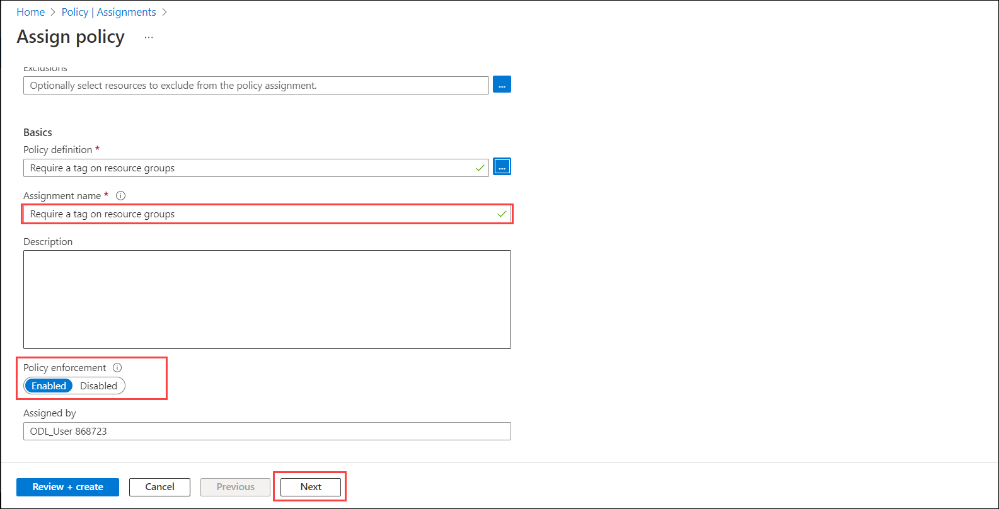   

1. Select **Next**, then select **Next** again to move to the Parameters tab (you could also just have selected the parameters tab directly).In the Parameters tab,Enter the text **Environment** in the Tag Name.

      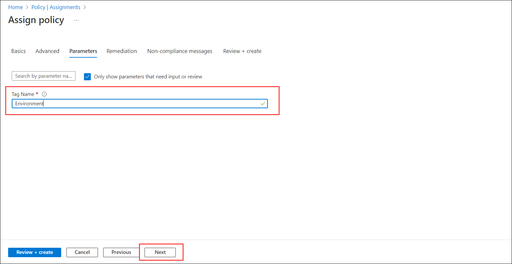  
      
1. In the Remediation tab, leave the default settings as they are then select **Next**.
    
1. You're now in the Non-compliance messages tab.  In the non-compliance message field, enter **An environment tag is required**, then select **Next**. Note: this message will appear as the reason for non-compliance for resource groups that were created before the policy assignment and do not have an Environment tag.

      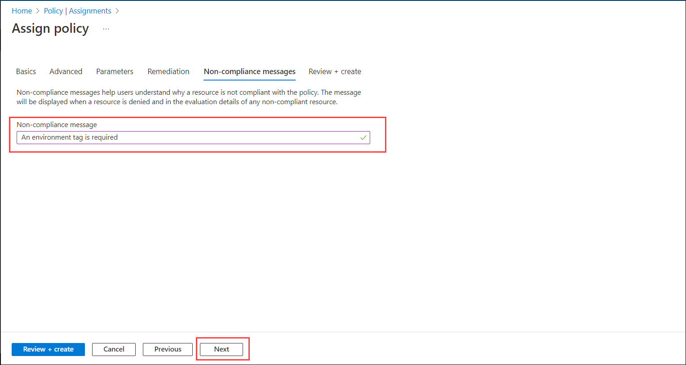  
      
1. Review the policy assignment, then select **Create**.  If you don’t immediately see the policy, select **Refresh**. Note: It may take up to 30 minutes for the policy to take effect, but usually happens much faster.

      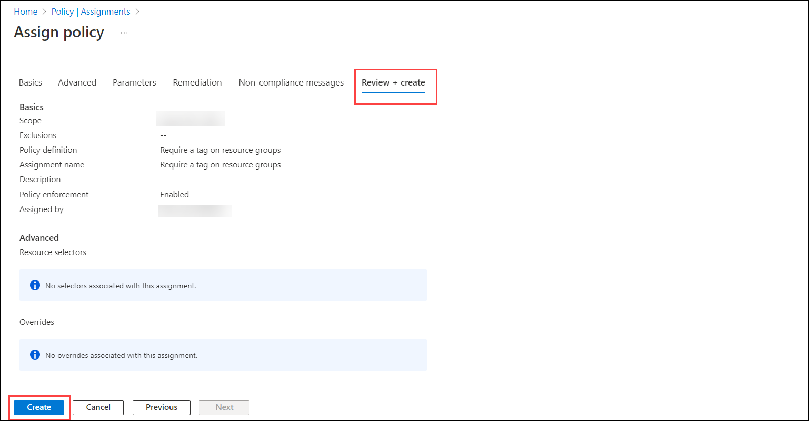      

1. Exit from the Policy definition page, by select the **X** on the top right corner of the page.

1. Exit from the Initiative definition page, by select the **X** on the top right corner of the page.

1. Keep this browser tab (Policy – Microsoft Azure) open for the next task.

## Task 2: Impact of tag.

In this task you'll see the impact of the Azure policy assignment, by attempting to create a resource group in Azure that does not have a tag.

1. Open the browser tab, Home – Microsoft Azure.

1. Form the top of the page, search for **Resource groups**.

     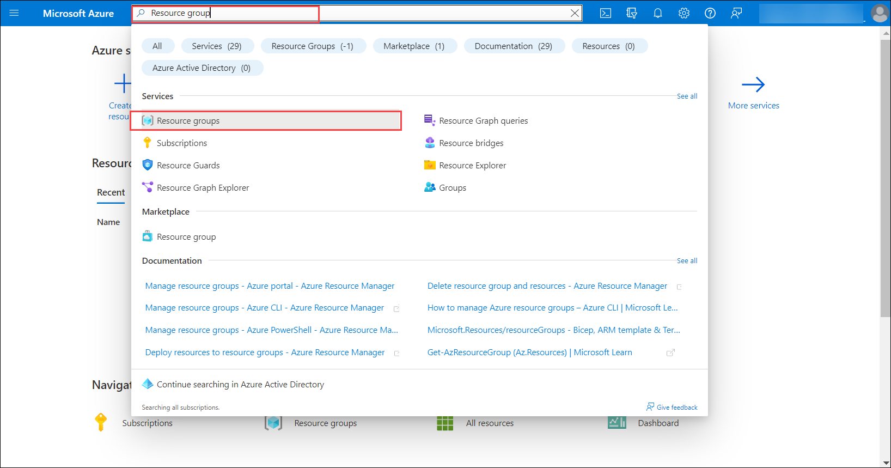   

1. From the top left corner of the page, select **+ Create**.

     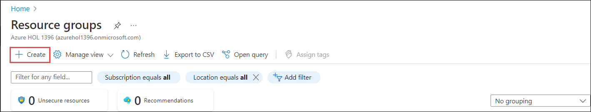    

1. From the Basics tab of the Create a resource group, in the Resource group field enter **SC900-Labs**, leave the Subscription field as is and Leave the Region setting to the default, then select **Next: Tags**.

     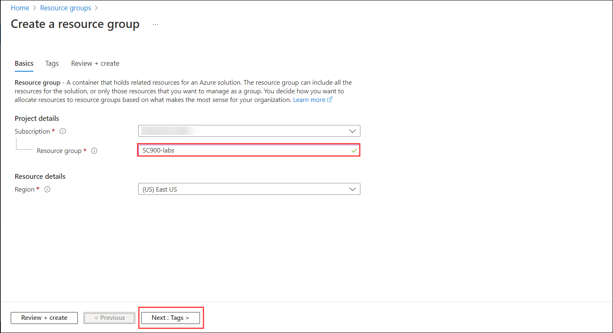  

1. Leave the tag Name and Value field empty.  DO NOT POPULATE, then select **Review + create**.

     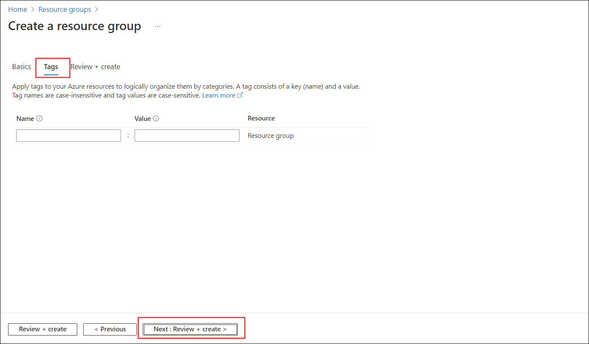 

1. You'll see a Validation failed message on the top of the screen.The condition that is part of the Azure policy was not satisfied so the resource group creation was blocked, for non-compliance. Note: If you don’t see the failure message and the resource group was created, it is because the policy has not yet taken effect.  Go the Policy page for the policy you created in the previous task and once the policy takes effect you'll see that the resource is not compliant.  The details page will include the non-compliance message.

1. Validation Failed.

    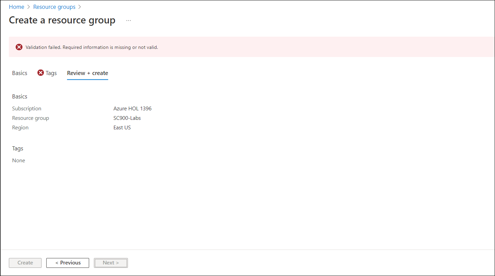
    
1. From the Create a resource group window, select **Previous**.

    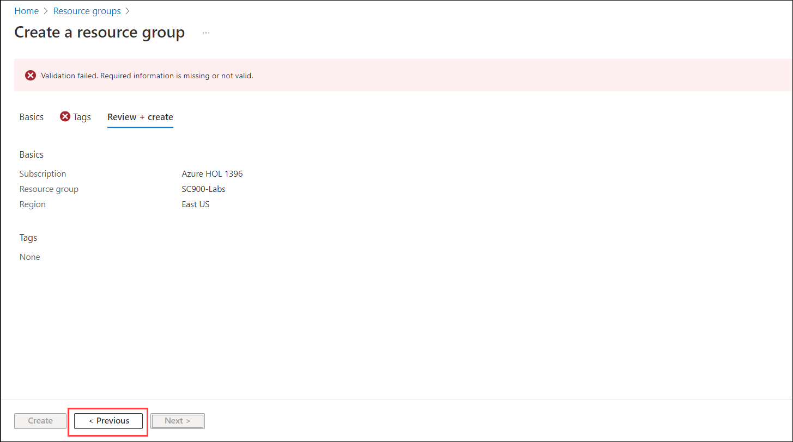

1. You're back in the Tags page for Create a resource group.  In the Name field enter **Environment** and in the Value field enter **SC900-Labs**, then select **Next: Review + Create >**.

    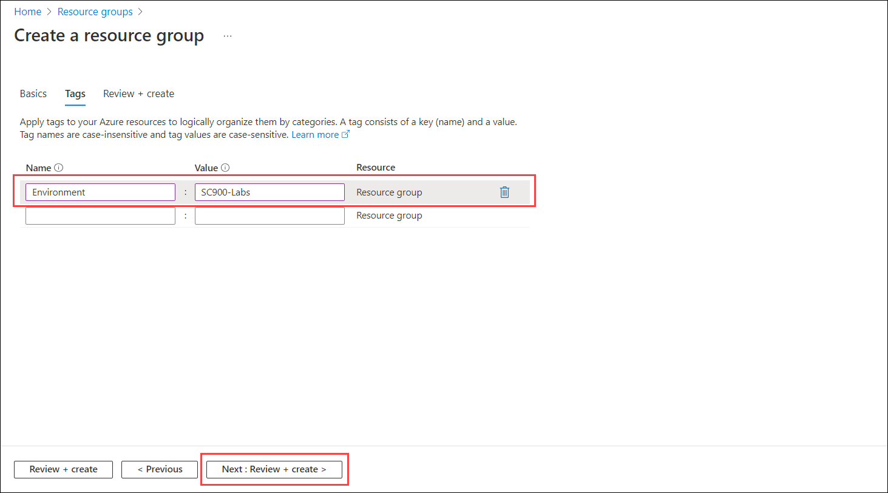
    
1. Verify the tag and select **Create**.

     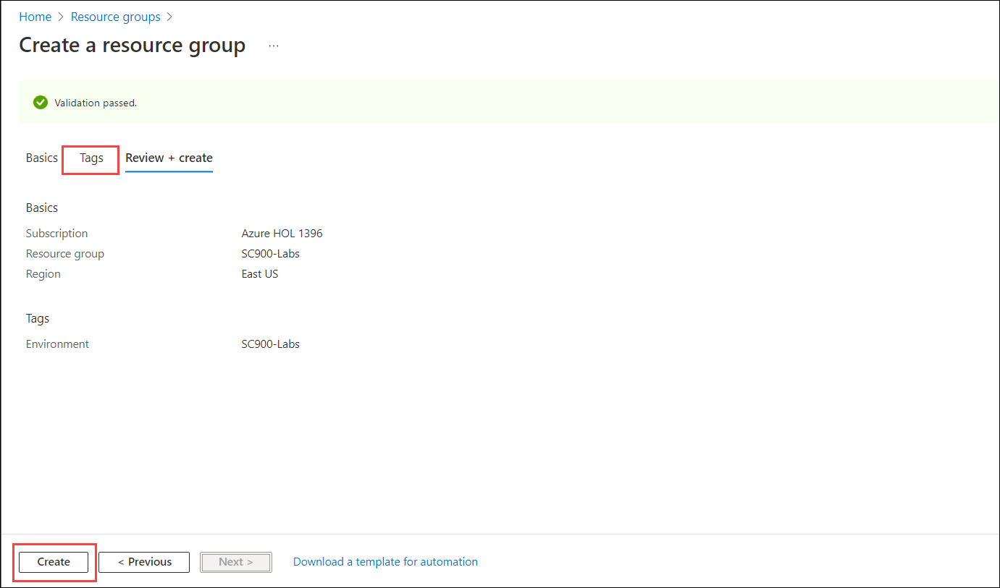  
     
 1. Navigate to the **Policy**,and click on **Compliance** from the left navigation pane select **Refresh**.

    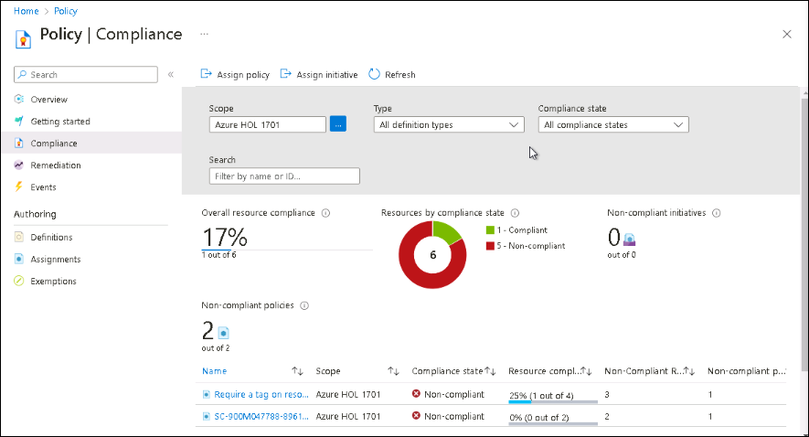
    
1. **Note:** It may take up to 30-40 minutes for the policy to take effect.

1. Exit from the Policy assignments page by selecting the **X** on the top right corner of the screen.

1. You are now in the Azure services home page.  Keep this page open, you will need it for the next task.
 
 
## Task 3 (Optional): Steps to remediate a non-compliant resource group.
In this task, you'll walk through the steps to remediate a non-compliant resource group. NOTE: the Azure subscription used for the lab will experience longer than normal delay to update the compliance status of a remediated resource group.

1. From the Azure home page, select **policy**. This opens the Policy home page that provides a dashboard view.  The scope for the Dashboard view is the Azure subscription provided by the authorized lab hoster.  

1. You should see the policy you created earlier, select it.

1. On the top of the page, under Essentials, you can see the name, description, and other essential information.  Note that the policy shows as non-compliant.  Select the policy for more information on why the policy is non-compliant. Here you can see that a resource listed as **sc900-module4** is non-compliant.  This is an example of a resource group that was created, previous to the creation of the policy. Select **Details** for more information.  Here you can see the compliance message that an environment tag is required.  Select the **X** on the top right to close the window.

1. Select **sc900-module4** Resource Group
    1. Open the **Essentials** under the **+Create**
    1. Place the mouse cursor in the Tag field and select **Environment**.
    1. Place the mouse cursor in the Value field and select **SC900-Labs**, then select **Save**.

1. Now return to the policy page.  Place your mouse cursor on the blue search box on the top of the page and select **Policy**.

1. From the left navigation panel, select **Compliance**.  As with the overview page, here you can view the compliance state of the listed policies and/or initiatives.  NOTE: although you've added the tag to the resource group, it will take time for the status to update.  Azure subscriptions used for lab purposes may experience longer than normal delays. If you wish you to wait for the compliance status for this resource to update, do not end the lab. Depending on the lab environment, it can take an hour or more to update.  

### Review

In this lab, you went through the Azure policy landing page. After the initial exploration of the Azure policy page, you went through the process of creating a policy and you were able to see the impact of that policy.
