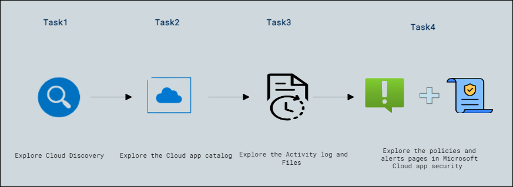

# Lab Scenario Preview: Lab-08: Explore Microsoft Cloud App Security

## Lab overview

In this lab, you will explore the capabilities of Microsoft Cloud App Security. You will walk through the information available on the Cloud Discovery dashboard as well as capabilities available to investigate findings and control impact to your organization through policies. Note: An organization must have a license to use Microsoft Cloud App Security which is a user-based subscription service.

## Objectives

After completing this lab, you will be able to:
 
- Explore Cloud Discovery
- Explore the Cloud app catalog
- Explore the Activity log and Files
- Explore the policies and alerts pages in Microsoft Cloud app security

## Architecture Diagram

Once you understand the lab's content, you can start the Hands-on Lab by clicking the **Launch** button located in the top right corner. This will lead you to the lab environment and guide. You can also preview the full lab guide [here](https://experience.cloudlabs.ai/#/labguidepreview/32808dd5-f2f8-4390-adff-9b9fa05011de) if you want to go through a detailed guide prior to launching the lab environment.
