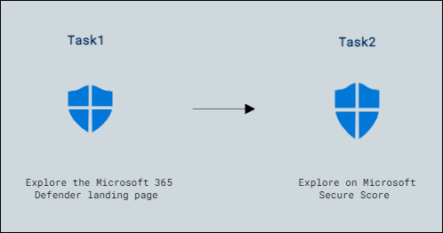

# Lab Scenario Preview: Lab-09: Explore the Microsoft 365 Defender portal

## Lab overview

In this lab you will explore the Microsoft 365 Defender portal by walking through the content displayed on the landing page. You will also explore the options on the navigation panel which provide quick access to functionality that is part of Microsoft’s Extended Detection and Response (XDR) solution: Microsoft Defender for Endpoints, and Microsoft Defender for Office 365 (email and collaboration). Lastly you will also explore how Microsoft Secure Score can help an organization improve its security posture.

## Objectives

After completing this lab, you will be able to:

- Explore the Microsoft 365 Defender landing page
- Explore on Microsoft Secure Score

## Architecture Diagram

Once you understand the lab's content, you can start the Hands-on Lab by clicking the **Launch** button located in the top right corner. This will lead you to the lab environment and guide. You can also preview the full lab guide [here](https://experience.cloudlabs.ai/#/labguidepreview/2e2a4f6b-fef1-4222-aa61-3456a4feb8d8) if you want to go through a detailed guide prior to launching the lab environment.
