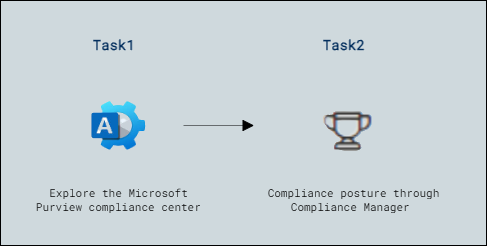

# Lab Scenario Preview: Lab-12: Explore the Microsoft Purview compliance center & Compliance Manager

## Lab overview

In this lab, you will explore the Microsoft Purview compliance center home page and ways in which the capabilities of Compliance manager can help organizations improve their compliance posture.

## Objectives

After completing this lab, you will be able to:

- Explore the Microsoft Purview compliance center
- Compliance posture through Compliance Manager

## Architecture Diagram

Once you understand the lab's content, you can start the Hands-on Lab by clicking the **Launch** button located in the top right corner. This will lead you to the lab environment and guide. You can also preview the full lab guide [here](https://experience.cloudlabs.ai/#/labguidepreview/138a16af-5c3a-474e-9373-9dd108a29d92) if you want to go through a detailed guide prior to launching the lab environment.
