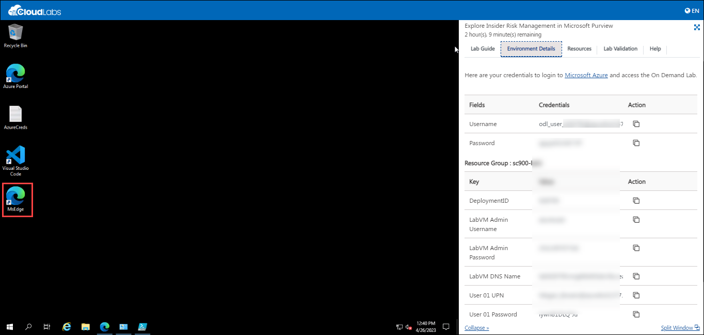
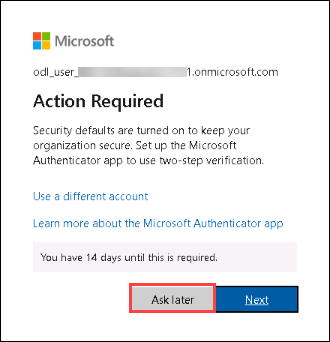

# Getting Started

1. Once the environment is provisioned, a virtual machine and lab guide will get loaded into your browser. Use this virtual machine throughout the workshop to perform the lab.

1. To get the lab environment details, you can select the **Environment Details** tab.

    

1. You can also open the Lab Guide on a separate full window by selecting the **Split Window** button on the bottom right corner.

        

1. Also, you can **start, stop and restart** the virtual machines from the **Resources** tab.

    
    
1. Click on **Next** from the bottom right and follow the instructions to perform the lab.

    
   
### Log in to Microsoft 365 Admin Centre

1. In the virtual machine (VM) on the left, click on Microsoft Edge shortcut as shown below.

    

    >**Note**:On the Welcome to Microsoft Edge page, select **Start without your data** and on the help for importing Google browsing data page, select the **Continue without this data** button. Then, proceed to select **Confirm and start browsing** on the next page
1. Open Microsoft Edge. In the address bar enter **admin.microsoft.com**. Please open this in a new private window.

      

1. In the Sign in window, sign in with your admin credentials.
   * Username: <inject key="AzureAdUserEmail"></inject>
       
1. Now enter the password and click on Sign in.
  
    1.  Get the user credentials provided in the environment details page and paste the value in the username section and then select **Next**.
     
    1. Enter the admin password which should be provided by your lab hosting provider. Select **Sign in**.
        * Password: <inject key="AzureAdUserPassword"></inject>
    
        
     
    1. When prompted to protect the account, Please select **Skip for now**.

        
        
    1. When prompted to Action Required, Please select **Ask later**

                  
     
    1. When prompted to stay signed- in, select **Yes**. This takes you to the Microsoft 365 admin center page.
